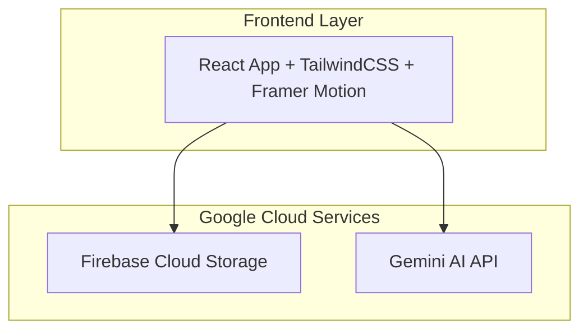

# BuildFlow MVP Design Document

## Overview

BuildFlow is a React-based web application that provides an interactive DIY project manual experience. The system uses Firebase Cloud Storage for all data management and integrates with Gemini AI to deliver both static demo content and dynamic AI-generated project instructions. The architecture supports a dual-mode operation: Demo Mode for reliable demonstrations using preloaded content, and Live Mode for real-time AI generation.

## Architecture

### High-Level Architecture



### System Components

1. **Frontend Application**: React SPA with responsive design and smooth animations
2. **Storage Layer**: Firebase Cloud Storage for all data (JSON files, images, media assets)
3. **AI Integration**: Gemini API for dynamic content generation (called directly from frontend)
4. **Authentication**: Firebase Authentication for user management
5. **Database**: Firebase Firestore for metadata and user preferences (optional)

## Components and Interfaces

### Frontend Components

#### 1. Homepage Component
- **Purpose**: Display manual library and provide project creation entry point
- **Props**: `manuals: Manual[]`, `onCreateNew: () => void`, `onOpenManual: (id: string) => void`
- **State**: Loading states, error handling
- **Data Flow**: Fetches manual list from Firebase Cloud Storage on mount

#### 2. MaterialsView Component
- **Purpose**: Display materials grid with pricing and confirmation actions
- **Props**: `materials: Material[]`, `totalPrice: number`, `onConfirm: () => void`, `onCancel: () => void`
- **State**: Material selection, loading states
- **Features**: Amazon link integration, price calculations

#### 3. FlipbookView Component
- **Purpose**: Interactive step-by-step instruction display
- **Props**: `steps: Step[]`, `materials: Material[]`, `projectName: string`
- **State**: Current page, navigation history, image loading
- **Features**: Framer Motion animations, Firebase image loading

#### 4. TextInput Component
- **Purpose**: Product idea input and generation trigger
- **Props**: `onSubmit: (idea: string) => void`, `disabled: boolean`
- **State**: Input value, submission status
- **Behavior**: Conditional based on system state (demo/live mode)

### Firebase Service Interfaces

#### 1. Manual Generation Service
```typescript
interface GenerateManualRequest {
  productIdea: string;
  userId: string;
}

interface GenerateManualResponse {
  manualId: string;
  steps: Step[];
  materials: Material[];
  totalPrice: number;
  firebasePath: string;
}
```

#### 2. Manual Retrieval Service
```typescript
interface GetManualRequest {
  manualId: string;
}

interface GetManualResponse {
  manual: Manual;
  steps: Step[];
  materials: Material[];
}
```

## Data Models

### Core Data Structures

#### Manual Model
```typescript
interface Manual {
  id: string;
  productName: string;
  thumbnailURL: string;
  firebaseManualPath: string;
  firebaseImagePath: string;
  createdAt: Date;
  totalPrice: number;
  stepCount: number;
}
```

#### Step Model
```typescript
interface Step {
  stepNumber: number;
  title: string;
  description: string;
  imageURL: string;
  estimatedTime: number;
  tools: string[];
  notes?: string;
}
```

#### Material Model
```typescript
interface Material {
  id: string;
  name: string;
  description: string;
  quantity: number;
  unitPrice: number;
  totalPrice: number;
  imageURL: string;
  amazonURL?: string;
  category: string;
}
```

### Storage Schema

#### Firebase Cloud Storage Directory Structure
```
/manuals/
  /demo/
    /keyboard/
      materials.json
      steps.json
      metadata.json
      /images/
        thumbnail.jpg
        step-1.jpg
        step-2.jpg
    /lamp/
      materials.json
      steps.json
      metadata.json
      /images/
        thumbnail.jpg
        step-1.jpg
        step-2.jpg
  /generated/
    /{userId}/
      /{manualId}/
        materials.json
        steps.json
        metadata.json
        /images/
          thumbnail.jpg
          step-1.jpg
          step-2.jpg
```

## State Management

### Application State
```typescript
interface AppState {
  mode: 'demo' | 'live';
  currentView: 'home' | 'materials' | 'flipbook' | 'input';
  currentManual: Manual | null;
  loading: boolean;
  error: string | null;
}
```

### State Transitions
- **Demo Mode (state = true)**: All data loaded from Firebase Cloud Storage
- **Live Mode (state = false)**: Dynamic generation via Gemini API
- **View Navigation**: Maintains state during transitions
- **Error Handling**: Graceful fallbacks to cached data

## Error Handling

### Error Categories and Responses

#### 1. Network Errors
- **Firebase Fetch Failures**: Retry with exponential backoff, fallback to cached data
- **Firebase Image Loading**: Show placeholder images, retry in background
- **Gemini API Timeouts**: Display user-friendly error, offer retry option

#### 2. AI Generation Errors
- **Gemini API Failures**: Fallback to demo mode temporarily
- **Invalid Responses**: Validate and sanitize AI output
- **Rate Limiting**: Queue requests and inform user of delays

#### 3. Data Validation Errors
- **Malformed JSON**: Log error, use default structure
- **Missing Images**: Use placeholder images with loading indicators
- **Price Calculation Errors**: Display warning, allow manual override

### Error Recovery Strategies
```typescript
interface ErrorRecovery {
  retryAttempts: number;
  fallbackData: any;
  userNotification: string;
  logLevel: 'info' | 'warn' | 'error';
}
```

## Performance Optimization

### Frontend Optimizations
- **Code Splitting**: Lazy load flipbook components
- **Image Optimization**: WebP format with fallbacks, progressive loading
- **Caching Strategy**: Service worker for offline manual access
- **Bundle Optimization**: Tree shaking, dynamic imports

### Backend Optimizations
- **Firebase Performance**: Connection pooling, batch operations, CDN caching
- **Gemini API**: Request batching, response caching for similar queries
- **Data Structure**: Optimized JSON structure for faster parsing

### Loading Strategies
- **Progressive Enhancement**: Core functionality loads first
- **Skeleton Screens**: Show layout while content loads
- **Prefetching**: Load next flipbook page in background

## Security Considerations

### Data Protection
- **Input Sanitization**: Validate all user inputs before processing
- **Firebase Security Rules**: Secure storage access patterns and user authentication
- **API Key Management**: Secure Gemini API key handling
- **User Authentication**: Firebase Authentication for user management

### Content Security
- **XSS Prevention**: Sanitize AI-generated content
- **CSRF Protection**: Implement proper token validation
- **Rate Limiting**: Prevent abuse of AI generation endpoints

## Testing Strategy

### Unit Testing
- **Component Testing**: React Testing Library for UI components
- **Utility Functions**: Jest for data processing and validation
- **API Mocking**: Mock Firebase services and Gemini API
- **Coverage Target**: 80% code coverage minimum

### Integration Testing
- **End-to-End Flows**: Cypress for complete user journeys
- **Firebase Integration**: Test Firebase services with real data
- **Cross-Browser**: Ensure compatibility across modern browsers
- **Performance Testing**: Lighthouse CI for performance regression

### Testing Environments
- **Development**: Local mocks and test data
- **Staging**: Real Firebase services with test data
- **Production**: Monitoring and error tracking

## Deployment Architecture

### Infrastructure Configuration
```yaml
# Firebase Configuration
Resources:
  - Firebase Cloud Storage
  - Firebase Authentication
  - Firebase Hosting
  - Security Rules
```

### CI/CD Pipeline
1. **Build**: React app compilation and optimization
2. **Test**: Automated test suite execution
3. **Deploy**: Deployment to Firebase Hosting
4. **Verify**: Health checks and smoke tests

### Monitoring and Observability
- **Firebase Analytics**: User behavior and performance metrics
- **Error Tracking**: Sentry for frontend error monitoring
- **Performance**: Firebase Performance Monitoring
- **Alerts**: Firebase alerts for critical issues